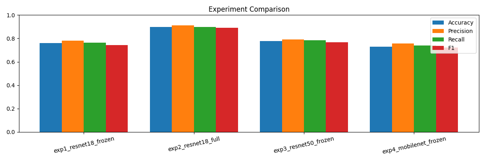
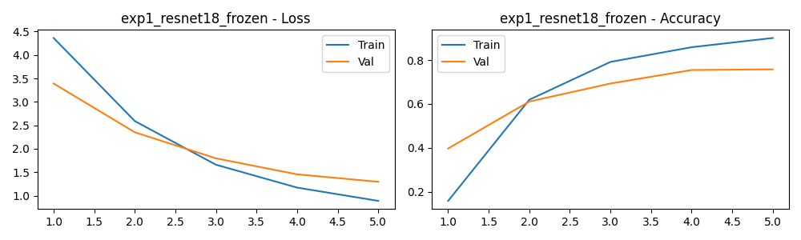
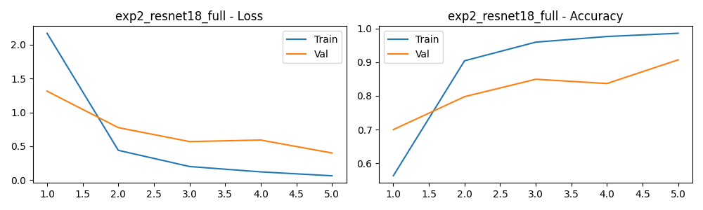
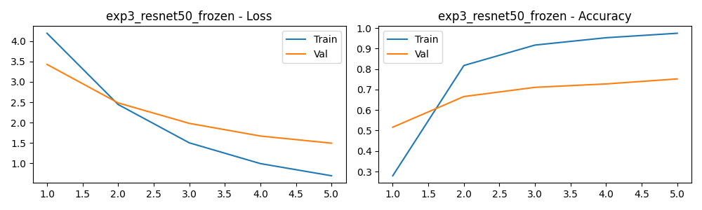
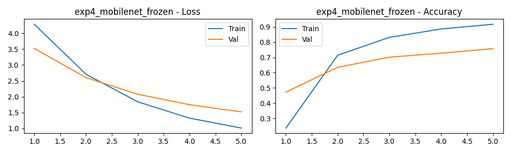
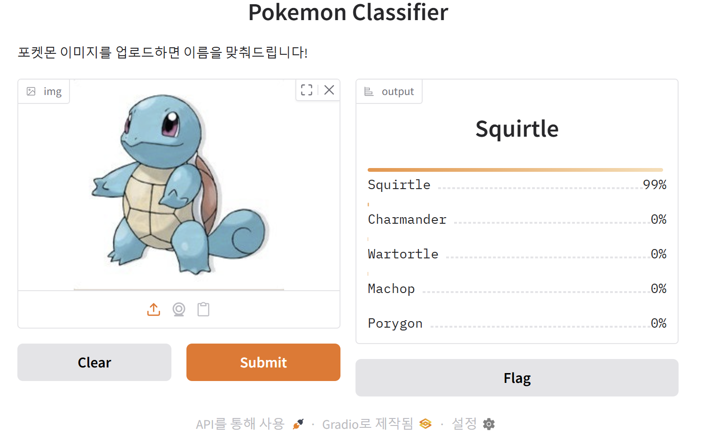
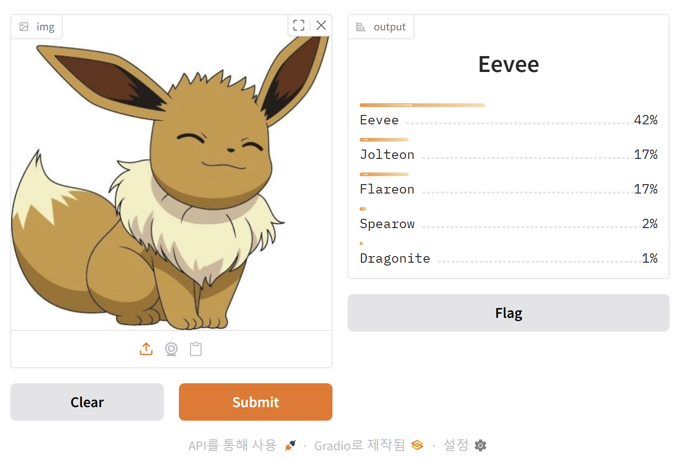

# PokeClassifier ⚡

> 전이학습(Transfer Learning)을 활용한 포켓몬 이미지 분류기

---

## 프로그램 소개

포켓몬 이미지를 입력하면 150종의 포켓몬 중 어떤 포켓몬인지 분류하는 딥러닝 모델입니다.  
ImageNet으로 사전학습된 CNN 백본 모델에 전이학습을 적용하여 학습했습니다.

## 데이터셋

- [7,000 Labeled Pokemon - Kaggle](https://www.kaggle.com/datasets/lantian773030/pokemonclassification)
- 총 6,820장의 이미지, 150개 클래스
- Train / Val / Test = 70% / 15% / 15% 비율로 분할

## 실험 결과

### 실험 설계

총 4가지 실험 설정으로 성능을 비교했습니다.

| 실험 | Backbone | Fine-tuning 방식 |
|------|----------|-----------------|
| exp1 | ResNet18 | Frozen (FC layer만 학습) |
| exp2 | ResNet18 | Full fine-tuning (전체 학습) |
| exp3 | ResNet50 | Frozen (FC layer만 학습) |
| exp4 | MobileNetV2 | Frozen (classifier만 학습) |

### 성능 비교

| 실험 | Accuracy | Precision | Recall | F1 |
|------|----------|-----------|--------|----|
| exp1_resnet18_frozen | 0.7595 | 0.7823 | 0.7633 | 0.7431 |
| exp2_resnet18_full | **0.8993** | **0.9106** | **0.8972** | **0.8915** |
| exp3_resnet50_frozen | 0.7771 | 0.7901 | 0.7833 | 0.7663 |
| exp4_mobilenet_frozen | 0.7302 | 0.7553 | 0.7389 | 0.7230 |

> ✅ **최고 성능: exp2 (ResNet18 Full fine-tuning)** — Accuracy 89.93%

### 실험 결과 분석

- **Full fine-tuning vs Frozen**: 같은 ResNet18이라도 전체 레이어를 학습한 exp2가 FC만 학습한 exp1보다 약 14%p 높은 성능을 보임
- **Backbone 크기**: ResNet50이 ResNet18보다 더 크지만, Frozen 상태에서는 큰 차이가 없음
- **경량 모델**: MobileNetV2는 가장 빠르지만 성능은 가장 낮음

### 비교 차트

## Learning Curve

| exp1 - ResNet18 Frozen | exp2 - ResNet18 Full |
|------------------------|----------------------|
|  |  |

| exp3 - ResNet50 Frozen | exp4 - MobileNetV2 Frozen |
|------------------------|---------------------------|
|  |  |

## 데모 GUI

Gradio를 이용한 웹 데모를 제공합니다.  
포켓몬 이미지를 업로드하면 Top-5 예측 결과를 확인할 수 있습니다.

| 데모 1 | 데모 2 |
|--------|--------|
|  |  |
